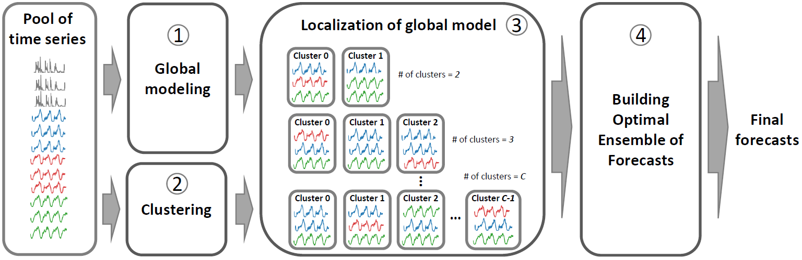

# A Global Modeling Framework for Load Forecasting in Distribution Networks 
## IEEE Transactions on Smart Grid

Paper in PDF is publicly available [here](https://ieeexplore.ieee.org/document/10092804).

We propose a framework for forecasting large groups of electricity load time series using global modeling approach and deep learning.

### Abstract
With the increasing numbers of smart meter installations,
scalable and efficient load forecasting techniques are
critically needed to ensure sustainable situation awareness within
the distribution networks. Distribution networks include a large
amount of different loads at various aggregation levels, such
as individual consumers, low-voltage feeders, and transformer
stations. It is impractical to develop individual (or so-called local)
forecasting models for each load separately. Additionally, such
local models also (i) (largely) ignore the strong dependencies
between different loads that might be present due to their spatial
proximity and the characteristics of the distribution network,
(ii) require historical data for each load to be able to make
forecasts, and (iii) are incapable of adjusting to changes in
the load behavior without retraining. To address these issues,
we propose a global modeling framework for load forecasting
in distribution networks that, unlike its local competitors,
relies on a single global model to generate forecasts for a
large number of loads. The global nature of the framework,
significantly reduces the computational burden typically required
when training multiple local forecasting models, efficiently exploits
the cross-series information shared among different loads,
and facilitates forecasts even when historical data for a load
is missing or the behavior of a load evolves over time. To
further improve on the performance of the proposed framework,
an unsupervised localization mechanism and optimal ensemble
construction strategy are also proposed to localize/personalize
the global forecasting model to different load characteristics.
Our experimental results show that the proposed framework
outperforms naive benchmarks by more than 25% (in terms
of Mean Absolute Error) on real-world dataset while exhibiting
highly desirable characteristics when compared to the local models
that are predominantly used in the literature.
